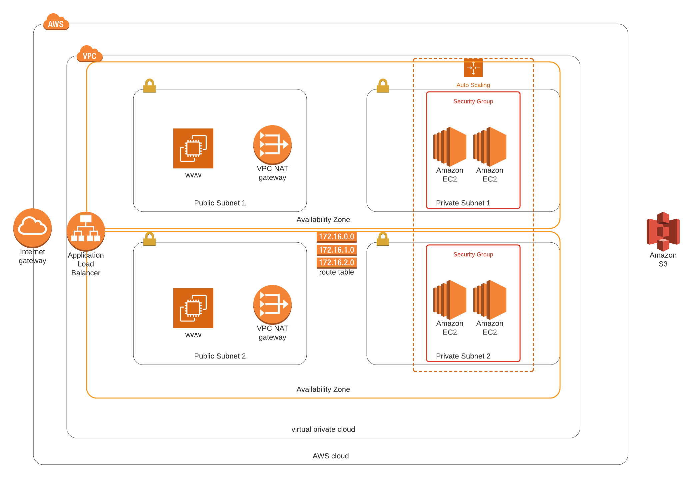

# Udacity-CloudFormation-Web-App-Deploy
This is the final project for the Deploy Infrastructure as Code Section of the Cloud Dev Ops Engineer Nano Degree


## Network Diagram


## Instillation Instructions
In order to deploy this infrastructure your machine must be set up to use the AWS CLI (that will obviously be hooked up to your AWS account).
First clone the project and change directories into the base of the project.
1. Run the command ```deploy-scripts/create.sh {NetworkStackName} network/deploy.yml network/parameters.json``` 
2. Watch and wait until this stack has completed deploying
3. Once the network stack has completed deploying run ```deploy-scripts/create.sh {ServerStackName} servers/deploy.yml servers/parameters.json```

